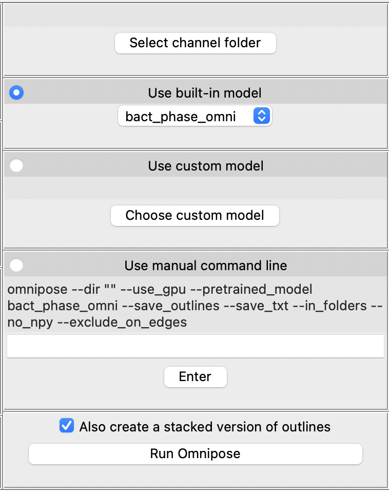
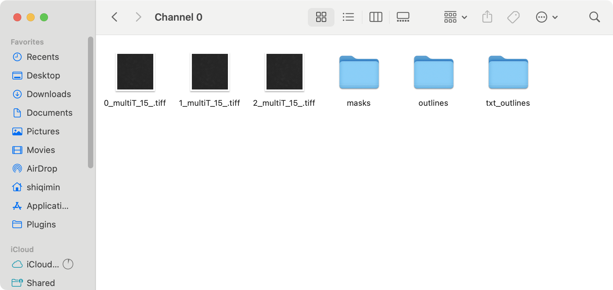

# Easy-to-use-Omnipose-Cell-Analysis

By Min

A program that generates outlines from images of cell shape using [Omnipose](https://github.com/kevinjohncutler/omnipose/tree/main). Only processes tiff image format.

This program is a new version of the [Omnipose_Cellprofiler-Pipeline](https://github.com/Archaea-Lab/Omnipose_Cellprofiler-Pipeline) by John Mallon. Rewritten to be more user-friendly and easier to use.


To use this program, you need to do the following:
- Have FIJI/ImageJ installed
- Set up an environment in Anaconda
- Fix an import error of one file inside local omnipose package


## Set up environment

#### Install FIJI/ImageJ

1. Download and install [FIJI](https://imagej.net/Fiji/Downloads) or [ImageJ](https://imagej.net/ij/download.html).

2. Make sure you know where the FIJI/ImageJ program is installed. You will need to choose the FIJI/ImageJ path manually in this program.

#### Environment setup

1. Download and install [Anaconda](https://www.anaconda.com/download).

2. Open terminal. You should see `(base)` in your command line. This tells you that you’re in your base conda environment. 

3. Create a new environment named omnipose by running the following command in your terminal:

    ```bash
    conda create -n omnipose 'python==3.10.12' pytorch
    ```

4. Activate this new omnipose environment, you should then see `(omnipose)` in your command line:

    ```bash
    conda activate omnipose
    ```
5. Install omnipose package into your new environment:

    ```bash
    pip install omnipose==1.0.6
    ```

    Also install natsort:

    ```bash
    pip install natsort
    ```

6. Install other necessary packages:

    ```bash
    conda install conda-forge::'openjdk=22.0.1'
    ```

    ```bash
    conda install conda-forge::'maven=3.9.9'
    ```

    ```bash
    pip install pyimagej==1.5.0
    ```


## Test the program
First, Download ZIP of this repository.

Then, unzip the ZIP file. Inside the folder, find the controller file named `ControllerVer3.py`. This file is the main program that you will run.

There are two ways to run this program: through termial or through an IDE like VSCode that can run Python scripts.


#### Run through terminal
1. Open terminal.
2. Activate the omnipose environment, you should then see `(omnipose)` in your command line:

    ```bash
    conda activate omnipose
    ```

3. In the terminal, write the following command, but don't press enter yet:

    ```bash
    python3 
    ```

4. Drag and drop the `ControllerVer3.py` file into the terminal. This will automatically add the file path to the command. You can also manually copy and paste the path to the terminal.

    ```bash
    python3 /path/to/ControllerVer3.py
    ```

5. Press enter to run the program. You should see an exception thrown in the terminal. Go to the Fix ImportError section to fix this exception.


#### Run through an IDE
1. Open an IDE like VSCode.
2. Open the `ControllerVer3.py` file in the IDE.
3. Select the omnipose environment. 
   
   If you're using VSCode, Press `Ctrl+Shift+P` to open the command palette. Type "Python" and choose `Python: Select Interpreter`. Select your omnipose environment in the dropdown list, which should look like this:
    ```
    Python 3.10.9 ('omnipose') /opt/anaconda3/envs/omnipose/bin/python
    ```
1. Run the file. You should see an exception thrown in the terminal. Go to the Fix ImportError section to fix this exception.


## Fix ImportError
```
File "/opt/anaconda3/envs/test/lib/python3.10/site-packages/peakdetect/peakdetect.py", line 5, in <module>
    from scipy import fft, ifft
ImportError: cannot import name 'ifft' from 'scipy' (/opt/anaconda3/envs/test/lib/python3.10/site-packages/scipy/__init__.py)
```
To fix this error, you need to go to the the `peakdetect.py` file that throws the importError. 

1. Copy the path to the `peakdetect.py` from the error message, in this case `/opt/anaconda3/envs/test/lib/python3.10/site-packages/peakdetect/peakdetect.py`.
2. In your file explorer, navigate to the `peakdetect.py` file. 
3. Open the file in a code editor like VSCode. You can also use a text editor, like TextEdit on Mac.
4. The error happens at line 5 inside the `peakdetect.py`. Change the code at line 5

    from:
    
    

    ```python
    from scipy import fft, ifft
    ```
    to:

    

    ```python
    from scipy.fft import fft, ifft
    ```

5. Save the modified `peakdetect.py` file. You should now be able to run the program.

# How to use the program


You can run this program by running its `ControllerVer3.py` file in the omnipose environment, through terminal or an IDE like VSCode. See more details in the Test the program section above.

The program has two important buttons: `Preprocess image` on the bottom left and `Run Omnipose` on the bottom right.

## Preprocess image

By clicking the `Preprocess image` button, you can split your selected Raw Image into channels. 

For example, if you have a 2-channel image stack, this will split it into 2 separate channel folders, each containing the frames of that channel. There will also be 2 new image stacks, containing the frames for each channel. The result will be saved to the Save Folder you selected, and the Raw Image will not be modified.

Before: 


After: 


You can also preprocess a folder of images. The program will first stack the images inside the folder into a single image stack, and split them into channels.

Before: 


After: 


## Run Omnipose



By clicking the `Run Omnipose` button, you can generate outlines for the selected channel. There're three options you can choose to run Omnipose: "Use built-in model", "Use custom model", and "Use manual command line".

- `Use built-in model`

    This option can only process single-channel folder. It will use the built-in model in Omnipose to generate outlines for the selected channel.

- `Use custom model`
    
    This option can only process single-channel folder. It will use the custom model you provide to generate outlines for the selected channel.

- `Use manual command line`

    This option is essentially the same as running Omnipose in the terminal. It will run the command shown inside the gray box. You can enter your own command in the entry.

After running Omnipose, you will see the outlines generated by Omnipose. The outlines will be saved inside the selected channel folder. 

Before:


After:

