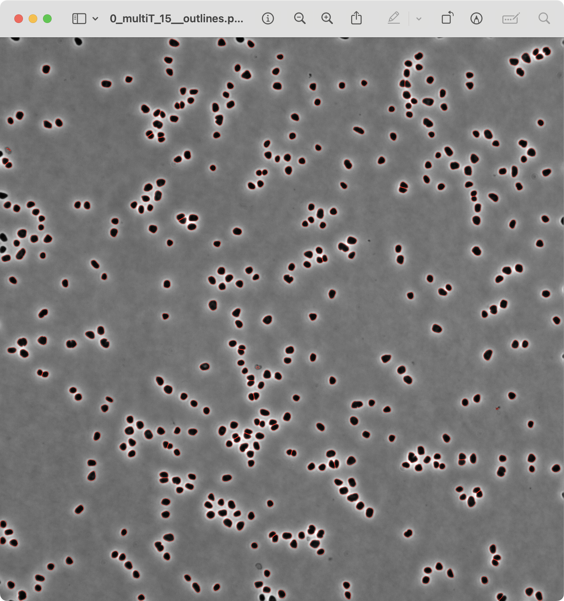

# Easy-to-use-Omnipose-Cell-Analysis

By Min

A program that generates outlines from images of cell shape using [Omnipose](https://github.com/kevinjohncutler/omnipose/tree/main). Only processes tiff image format.

This program is a new version of the [Omnipose_Cellprofiler-Pipeline](https://github.com/Archaea-Lab/Omnipose_Cellprofiler-Pipeline) by John Mallon. Rewritten to be more user-friendly and easier to use.


To use this program, you need to do the following:
- Have FIJI/ImageJ installed
- Set up an environment in Anaconda


## Set up environment

#### Install FIJI/ImageJ

1. Download and install [FIJI](https://imagej.net/Fiji/Downloads) or [ImageJ](https://imagej.net/ij/download.html).

2. Make sure you know where the FIJI/ImageJ program is installed. You will need to choose the FIJI/ImageJ path manually in this program.

#### Setup new Anaconda environment

1. Download and install [Anaconda](https://www.anaconda.com/download).

2. Open terminal. You should see `(base)` in your command line. This tells you that you’re in your base conda environment. 

3. Create a new environment named easyOmnipose by running the following command in your terminal:

    ```bash
    conda create -n easyOmnipose 'python==3.10.12' pytorch
    ```

4. Activate this new easyOmnipose environment, you should then see `(easyOmnipose)` in your command line:

    ```bash
    conda activate easyOmnipose
    ```

5. Install the latest omnipose package into your new environment:

    ```bash
    git clone https://github.com/kevinjohncutler/omnipose.git
    cd omnipose
    pip install -e .
    ```

6. Install other necessary packages into your new environment: 

    ```bash
    conda install conda-forge::'openjdk=22.0.1'
    ```

    ```bash
    conda install conda-forge::'maven=3.9.9'
    ```

    ```bash
    pip install pyimagej==1.5.0
    ```

7. The new environment is now set up. You will need to run the program in this environment. See Run the program section below to learn how to run the program.

# Run the program
First, Download ZIP of this repository.

Then, unzip the ZIP file. Inside the folder, find the controller file named `ControllerVer3.py`. This file is the main program that you will run.

There are two ways to run this program: through termial or through an IDE like VSCode that can run Python scripts.


#### Run through terminal
1. Open terminal.
2. Activate the easyOmnipose environment, you should then see `(easyOmnipose)` in your command line:

    ```bash
    conda activate easyOmnipose
    ```

3. In the terminal, write the following command, but don't press enter yet:

    ```bash
    python3 
    ```

4. Drag and drop the `ControllerVer3.py` file into the terminal. This will automatically add the file path to the command. You can also manually copy and paste the path to the terminal.

    ```bash
    python3 /path/to/ControllerVer3.py
    ```

5. Press enter to run the program. You should see the program's window pop up after around 30 seconds. Go to How to use the program section to learn how to use the program.


#### Run through an IDE
1. Open an IDE like VSCode.
2. Open the `ControllerVer3.py` file in the IDE.
3. Select the easyOmnipose environment. 
   
   If you're using VSCode, Press `Ctrl+Shift+P` to open the command palette. Type "Python" and choose `Python: Select Interpreter`. Select your easyOmnipose environment in the dropdown list, which should look like this:
    ```
    Python 3.10.9 ('easyOmnipose') /opt/anaconda3/envs/easyOmnipose/bin/python
    ```
4. Run the file. You should see the program's window pop up after around 30 seconds. Go to How to use the program section to learn how to use the program.


# How to use the program


You can run this program by running its `ControllerVer3.py` file in the easyOmnipose environment, through terminal or an IDE like VSCode. See more details in the Run the program section above.

The program has two important buttons: `Preprocess image` on the bottom left and `Run Omnipose` on the bottom right.

## Preprocess image

By clicking the `Preprocess image` button, you can split your selected Raw Image into channels. 

For example, if you have a 2-channel image stack, this will split it into 2 separate channel folders, each containing the frames of that channel. There will also be 2 new image stacks, containing the frames for each channel. The result will be saved to the Save Folder you selected, and the Raw Image will not be modified.

Selected raw image stack: 


Preprocessed output in the Save Folder: 


You can also preprocess a folder of images. The program will first stack the images inside the folder into a single image stack, and split them into channels.

Selected folder of raw images: 


Preprocessed output in the Save Folder: 


## Run Omnipose


By clicking the `Run Omnipose` button, you can generate outlines for the selected channel folder. There're three options you can choose to run Omnipose: "Use built-in model", "Use custom model", and "Use manual command line".

- `Use built-in model`

    Omnipose will use the built-in model in Omnipose to generate outlines.

    This option has default arguments use_gpu, exclude_on_edges, and no_npy.

- `Use custom model`
    
    Omnipose will use the custom model you provide to generate outlines.

    This option has default arguments use_gpu, exclude_on_edges, and no_npy.

- `Use manual command line`

    This option is essentially the same as running Omnipose in the terminal. If this option is selected, `Run Omnipose` will run the command shown inside the gray box. You can enter your own command in the entry.

After running Omnipose, you will see the outlines generated by Omnipose. The outlines will be saved inside the selected channel folder. An additional image stack of the outlines will be created if the checkbox of `Also create a stacked version of outlines` is checked.

Before:


After:


With the `Also create a stacked version of outlines` checked:


The Outline generated by Omnipose will be saved in the `outlines` folder to be viewed, and the `txt_outlines` folder will contain the outlines in text format, which can be used for further analysis.

#### Example of Omnipose outline generated from a cell image

Before:


After:



Outlines are drawn in red.
